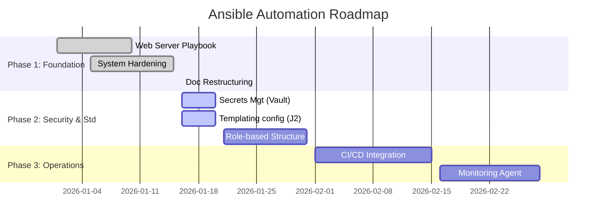

# 04. 專案發展路線圖 (Product Roadmap)

| 文件資訊           | 內容                            |
| :----------------- | :------------------------------ |
| **負責人**   | Product Manager, Lead Architect |
| **更新日期** | 2026-01-16                      |
| **狀態**     | 規劃中 (Planning)               |

## 1. 發展階段總覽 (Phases Overview)

本專案將分為三個主要階段，從基礎自動化建設，逐步邁向完全的 DevOps 整合。

## 2. 詳細規劃 (Detailed Plan)

### Phase 1: 基礎建設 (Foundation) - [COMPLETED]

此階段目標為建立可運作的 MVP (Minimum Viable Product)。

- [X] **Playbooks**: 完成 Web Server 與 System Hardening 自動化腳本。
- [X] **Inventory**: 建立 Production/Staging 環境分離架構。
- [X] **Documentation**: 完成 PRD, 技術架構書與操作手冊。

### Phase 2: 安全性與標準化 (Security & Standardization) - [IN PROGRESS]

此階段目標為提升程式碼品質與安全性，符合企業合規要求。

- [X] **Secrets Management**: 導入 `secrets/` 目錄與介紹 Ansible Vault 加密流程。
- [X] **Templating**: 引入 Jinja2 (`.j2`)，使 Nginx 設定檔具備動態變數能力。
- [ ] **Role Refactoring**: 將單一大檔 Playbook 拆解為 Ansible Roles (`roles/common`, `roles/web`, `roles/security`)，提升重用性。

### Phase 3: 自動化維運 (Operations & CI/CD) - [FUTURE]

此階段目標為實現無人值守的自動化流水線。

- [ ] **GitLab CI/CD**: 整合 GitLab Pipeline，代碼推上即自動進行 Syntax Check 與 Dry-run。
- [ ] **Monitoring**: 自動部署監控 Agent (如 Prometheus Node Exporter) 至所有主機。
- [ ] **Self-Service Portal**: 整合 Ansible Tower/AWX，提供非技術人員操作介面。

## 3. 風險評估 (Risk Assessment)

| 風險項目                   | 衝擊等級 | 緩解措施                                                                       |
| :------------------------- | :------- | :----------------------------------------------------------------------------- |
| **機敏資料外洩**     | High     | 強制實施 Ansible Vault 加密，並於 CI/CD 中掃描明碼。                           |
| **生產環境誤操作**   | High     | 嚴格區分 Inventory，並於 Production 執行前強制要求人工審核 (Manual Approval)。 |
| **設定漂移 (Drift)** | Medium   | 定期 (每日/每週) 排程執行 Ansible Playbook 以強制回寫設定。                    |
